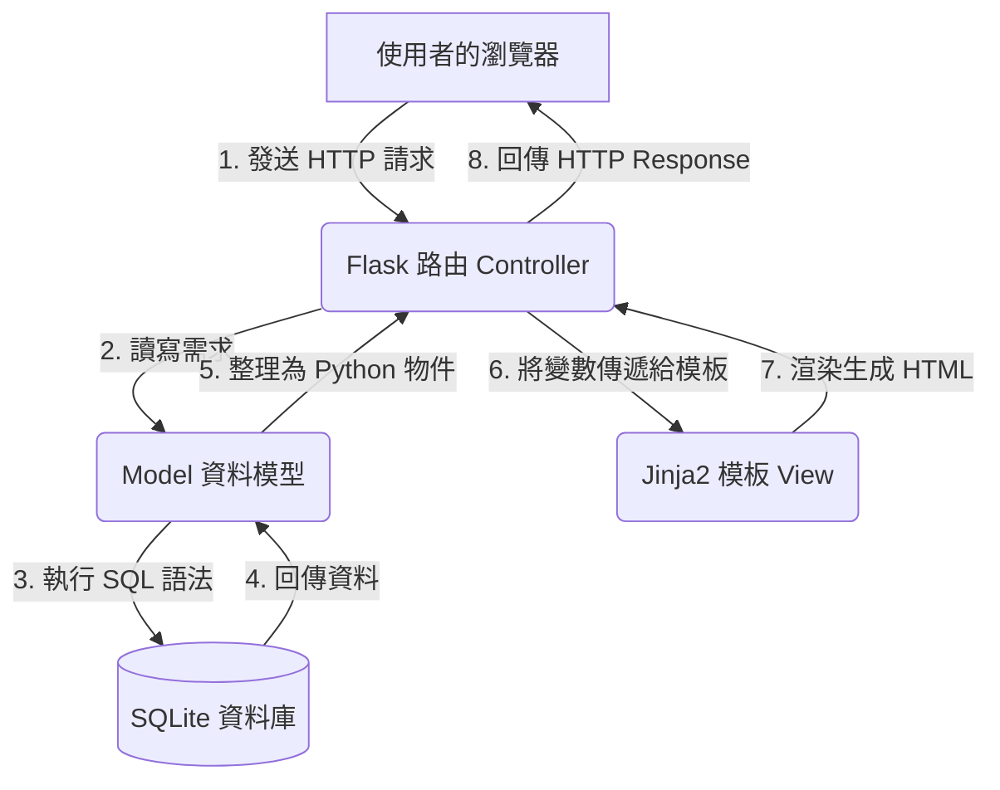

# 個人記帳簿系統 - 系統架構文件

## 1. 技術架構說明

為了達成快速開發且易於維護的目標，本專案採用輕量級的後端框架與資料庫，並使用伺服器端渲染（SSR）技術來呈現頁面。

### 選用技術與原因
- **後端框架：Python + Flask**
  Flask 是一個輕量級、具備高靈活性的 Python 網頁框架。它沒有過多預設的限制，非常適合用來快速打造初期（MVP）的個人記帳應用程式。
- **模板引擎：Jinja2**
  Flask 內建的模板引擎，能夠將後端 Python 處理好的資料安全且直覺地嵌入 HTML 中，由伺服器直接輸出完整的網頁給使用者，不需額外的前端框架（如 React/Vue）。
- **資料庫：SQLite**
  一個內建於 Python 的輕量級關聯式資料庫。它不需要額外啟動伺服器，資料皆存於單一實體檔案中，非常適合中小型與個人專案。

### MVC 模式說明
雖然 Flask 本身不強迫使用特定架構，但我們將依循 MVC（Model-View-Controller）的設計理念來組織程式碼：
- **Model（模型）**：負責與 SQLite 資料庫互動，定義「收支紀錄」的資料表結構（Schema），並處理所有的新增、查詢、修改與刪除（CRUD）邏輯。
- **View（視圖）**：對應到 Jinja2 模板，負責呈現使用者介面（如收支清單、新增表單、圓餅圖呈現）。
- **Controller（控制器）**：對應到 Flask 的路由（Routes）。它負責接收使用者的 HTTP 請求（例如送出表單），呼叫 Model 處理資料，接著將資料傳遞給 View 進行渲染，最後回傳給瀏覽器。

---

## 2. 專案資料夾結構

本專案將採用以下資料夾結構，以保持程式碼的清晰與職責分離：

```text
web_app_development/
├── app/                  # 應用程式主目錄
│   ├── models/           # 處理資料庫連線與資料表操作
│   │   └── record.py     # 收支紀錄的 Model 定義
│   ├── routes/           # 處理各個頁面的請求
│   │   └── main.py       # 首頁、新增、圖表等主要路由
│   ├── templates/        # 存放 HTML 模板 (Jinja2)
│   │   ├── base.html     # 共同佈景主題 (導覽列、頁尾)
│   │   ├── index.html    # 總覽與收支明細列表
│   │   └── chart.html    # 圓餅圖統計頁面
│   └── static/           # 靜態資源檔案
│       ├── css/          # 樣式表 (style.css)
│       └── js/           # 前端腳本 (例如呼叫 Chart.js 畫圓餅圖)
├── instance/             # 存放本地端獨有的檔案
│   └── database.db       # SQLite 資料庫檔案 (不會進入版本控制)
├── docs/                 # 專案說明文件
│   ├── PRD.md            # 產品需求文件
│   └── ARCHITECTURE.md   # 系統架構文件
├── app.py                # Flask 應用程式進入點，負責啟動伺服器
└── requirements.txt      # 記錄專案所需的 Python 套件 (如 Flask)
```

---

## 3. 元件關係圖

以下展示使用者操作時，系統各個元件如何互動：



---

## 4. 關鍵設計決策

1. **伺服器端渲染 (SSR) 取代前後端分離**
   - **原因**：為了符合「學生與工作者快速記帳」的 MVP 需求，不需要複雜的前端狀態管理。透過 Flask + Jinja2 直接渲染頁面，可以大幅降低開發初期的複雜度與時間成本。
2. **採用 SQLite 作為資料庫**
   - **原因**：個人記帳系統的資料量通常不大，且不會有高併發的寫入需求。SQLite 簡單易用、無需架設資料庫伺服器的特性，能讓開發與部署過程更順利。
3. **前端圖表整合方式**
   - **原因**：圓餅圖的繪製將依賴前端開源圖表庫（如 Chart.js）。Flask 的路由會在後端先將資料庫中的「各分類總支出」統計完成，打包成 JSON 格式傳遞給 Jinja2 模板，再由前端 JavaScript 讀取並渲染圖表。這可以避免在前端做複雜的資料處理。
4. **將資料庫檔案放在 instance/ 目錄**
   - **原因**：根據 Flask 官方建議，`instance/` 目錄專門用來存放不應該被進入版本控制（Git）的機密或本機專用檔案。將 `database.db` 放在此處可避免使用者的私密記帳資料不小心被推送到公開的 GitHub 儲存庫。
