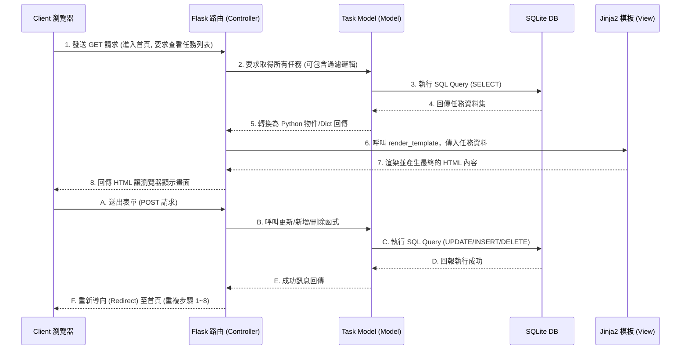

# 系統架構設計文件 (Architecture)

## 1. 技術架構說明

本專案「任務管理系統」採用了輕量級、適合快速迭代的後端架構，搭配伺服器端渲染 (Server-Side Rendering, SSR) 模式來產生前端頁面，不採用前後端分離，直接由後端產出完整畫面。

### 選用技術與原因
- **後端層框架：Python + Flask**
  - **原因**：Flask 作為一個微型 Web 框架，具備極佳的彈性與簡單的學習曲線。對於規模明確且需要快速迭代的 MVP 系統來說，能有效降低開發門檻並加速實作。
- **資料庫層：SQLite**
  - **原因**：零配置的嵌入式資料庫系統。資料直接儲存在單一檔案中，不需要額外設定與啟動獨立的資料庫伺服器，非常適合開發階段與初期單機應用的儲存。
- **視圖層與前端渲染：Jinja2 + HTML/CSS**
  - **原因**：Jinja2 是與 Flask 完美整合的模板引擎。我們可以將資料庫取出的任務資料直接塞入 HTML 中，降低處理前端狀態管理及非同步 API 請求的複雜度。

### Flask MVC 模式說明
本專案採用類似 MVC (Model-View-Controller) 的設計模式來有效切分程式職責：
- **Model（模型 / 資料庫操作）**：負責與 SQLite 溝通，定義任務 (Task) 的屬性（例如：標題、完成狀態、截止日期等），並封裝對應的資料庫互動邏輯 (CRUD)。
- **View（視圖 / 介面呈現）**：負責向使用者展示畫面。透過 Jinja2 引擎讀取 HTML 模板並帶入資料。其中也包含 CSS 的視覺處理（例如：利用特定的 class 將已完成的任務加上刪除線）。
- **Controller（控制器 / 路由與邏輯）**：負責接收使用者端的操作（如：新增、刪除、及過濾請求），根據請求呼叫對應的 Model 進行資料庫處理，再指定要宣染的 View 返回給使用者。

## 2. 專案資料夾結構

為了保持程式碼整潔與避免將所有邏輯塞在單一檔案內，我們根據元件的處理職責建立以下專案結構：

```text
web_app_development/
├── app.py                # 應用程式入口，專責初始化 Flask app 並掛載其他路由
├── database.py           # 資料庫連線配置或初始化設定（幫助快速重建 Table）
├── requirements.txt      # Python 專案的相依套件清單
├── README.md             # 專案啟動說明文件
├── docs/                 # 系統文件目錄
│   ├── PRD.md            # 產品需求文件
│   └── ARCHITECTURE.md   # 系統架構設計文件 (本文件)
├── app/                  # 主要應用系統目錄 (Package)
│   ├── models/           # Model 層：定義資料表與資料存取邏輯
│   │   └── task.py       
│   ├── routes/           # Controller 層：定義 API 與畫面路由邏輯
│   │   └── task_routes.py
│   ├── templates/        # View 層：Jinja2 的 HTML 模板檔存放處
│   │   ├── base.html     # 共用的 HTML 骨架（含 header/footer）
│   │   └── index.html    # 任務列表的主畫面與操作表單
│   └── static/           # 靜態資源目錄
│       ├── css/
│       │   └── style.css # 網頁排版、顏色與視覺回饋（含刪除線效果）樣式
│       └── js/
│           └── main.js   # 處理前端簡單互動（如：刪除前跳出確認視窗）
└── instance/             # 環境配置或動態產生檔，通常會加進 .gitignore
    └── database.db       # SQLite 實體資料庫檔案
```

## 3. 元件關係圖

以下展示使用者操作時，前後端各個元件的互動與生命週期：



## 4. 關鍵設計決策

1. **全面採用伺服器端渲染與 HTTP 表單傳遞**：
   - **原因**：為了快速交付符合 PRD 中核心 MVP 範圍的功能，系統不需實作複雜的前端狀態庫或大量的 JSON API 溝通。使用者所發起的「新增」、「編輯」、「標記狀態」以及「刪除」動作，都透過標準的 `form submit` 將 POST 請求傳給 Flask，完成資料庫操作後，利用 `redirect` 原力直接重新整理回首頁來顯示最新結果，架構單純且不易出錯。
2. **採用 Jinja2 與 CSS 配合實作視覺回饋（劃掉完成任務）**：
   - **原因**：為了達成 PRD 裡「將已完成任務加刪除線劃掉」的功能。我們避免用複雜的 JS 控制狀態，選擇在後端 Jinja2 在跑迴圈顯示任務時，檢查屬性：若 `task.status == 'completed'`，就在該項目的 HTML `<li>` 上加上一個 CSS class `.completed-task`。並統一在外部 `style.css` 透過這個 class 實作 `text-decoration: line-through;` 等灰階效果。這體現了良好的 View 層與樣式分離原則。
3. **適度分割目錄 (routes, models)**：
   - **原因**：即便是一個單一功能為主的系統，若全部邏輯擠在 `app.py` 中很容易在一兩天內將程式碼變得雜亂無章。一開始就把 Models 與 Routes 兩大模組抽離放在獨立的目錄中，不僅幫助開發能專注在單一職責上，也能在未來要增加（例如：加上標籤功能 或 登入功能）時能平滑且容易地橫向擴充。
