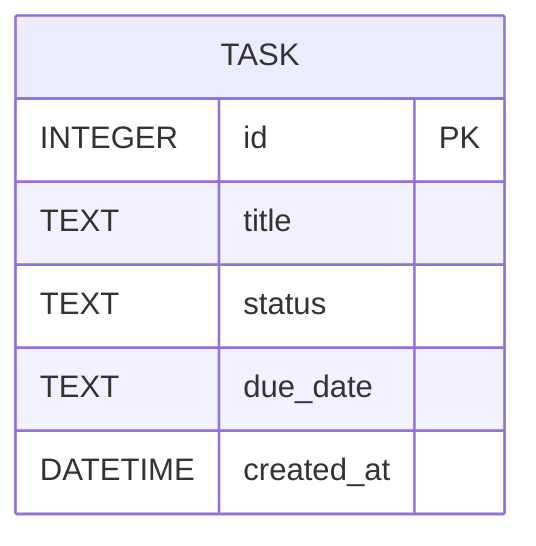

# 資料庫設計文件 (Database Design)

本文件依據 PRD 與系統架構文件，定義任務管理系統的資料庫結構、實體關聯圖 (ER 圖) 以及詳細欄位說明。

## 1. 實體關係圖 (ER Map)

我們主要的核心實體為 `tasks` (任務)。由於本應用為單一使用者的無登入輕量級系統，無需設計 `users` 等其他複雜表單，所有動作皆圍繞 `tasks` 進行。



## 2. 資料表詳細說明

### `tasks` (任務表)

用於儲存使用者的待辦事項與相關狀態。

| 欄位名稱 | 型別 | 鍵值 | 必填 | 預設值 | 描述 |
| :--- | :--- | :--- | :--- | :--- | :--- |
| **`id`** | INTEGER | PK | 是 | (Auto Increment) | 任務的唯一識別碼 |
| **`title`** | TEXT | - | 是 | - | 任務名稱或標題，為使用者輸入的主要內容 |
| **`status`** | TEXT | - | 是 | `'pending'` | 任務狀態。預設為 `'pending'` (未完成)。設定完成改為 `'completed'` |
| **`due_date`** | TEXT | - | 否 | `NULL` | 任務截止日期，存放 ISO 格式（如 `YYYY-MM-DD`）字串 |
| **`created_at`** | DATETIME | - | 是 | `CURRENT_TIMESTAMP` | 該筆任務建立的系統時間 |

## 3. SQL 建表語法

> 附註：實際的 SQL 語法會存放在專案底下的 `database/schema.sql`，並於應用程式初始化時使用。

```sql
CREATE TABLE IF NOT EXISTS tasks (
    id INTEGER PRIMARY KEY AUTOINCREMENT,
    title TEXT NOT NULL,
    status TEXT NOT NULL DEFAULT 'pending',
    due_date TEXT,
    created_at DATETIME DEFAULT CURRENT_TIMESTAMP
);
```
