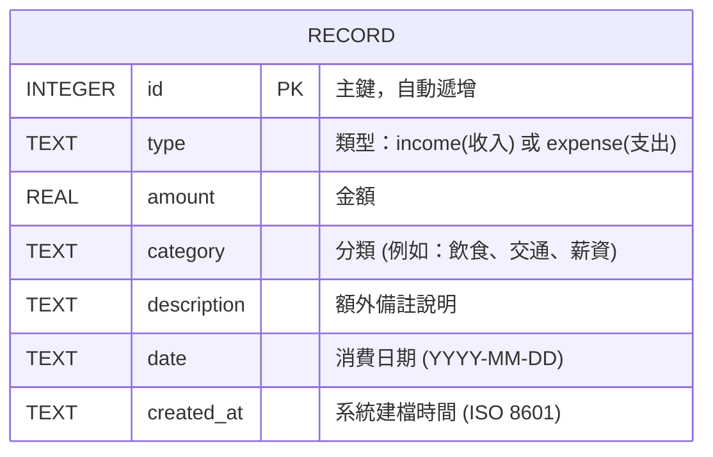

# 資料庫設計文件 (DB Design)

## 1. ER 圖（實體關係圖）

本系統為個人記帳簿，初期功能較單純，所有的收支紀錄統一存放在一張 `records` 資料表中。

## 2. 資料表詳細說明

**資料表名稱：`records` (收支紀錄表)**

用於儲存所有的收入與支出明細，後續計算餘額或是繪製圓餅圖都會從這張表撈取資料。

| 欄位名稱 | 型別 | 必填 | 說明 |
| :--- | :--- | :---: | :--- |
| `id` | INTEGER | 是 | Primary Key, 自動遞增的唯一識別碼 |
| `type` | TEXT | 是 | 收支類型，限制為 `income` 或 `expense` |
| `amount` | REAL | 是 | 交易金額 (可支援小數點的數值型別) |
| `category` | TEXT | 是 | 支出/收入的分類，例如：飲食、交通、薪水等 |
| `description` | TEXT | 否 | 額外的備註說明 (允許留空) |
| `date` | TEXT | 是 | 該筆交易的日期（格式建議：YYYY-MM-DD） |
| `created_at` | TEXT | 是 | 系統記錄建立的時間戳記，預設為當前時間 |

## 3. SQL 建表語法

完整的 SQLite 建表語法已儲存於 `database/schema.sql`。

## 4. Python Model 程式碼

處理 SQLite 連線與 CRUD (增刪改查) 的邏輯程式碼，已實作並儲存於 `app/models/record.py`，其中包含：
- `create()`: 新增一筆紀錄
- `get_all()`: 取得所有紀錄 (依日期排序)
- `get_by_id()`: 根據 ID 查詢單筆紀錄
- `update()`: 更新特定紀錄
- `delete()`: 刪除特定紀錄
- `init_db()`: 執行 `schema.sql` 來初始化建立資料表
