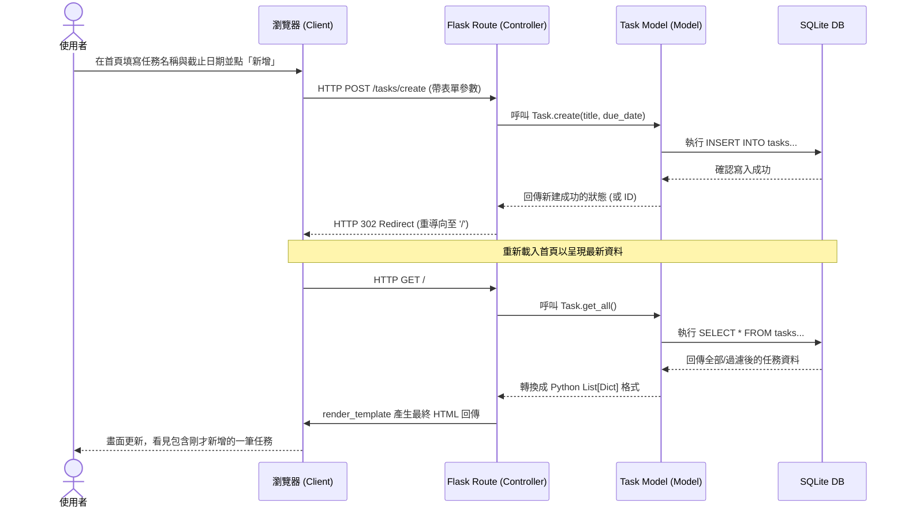

# 流程圖與系統設計 (Flowcharts)

本文件依據 PRD 與架構設計文件，視覺化呈現使用者的操作流程、系統背後的資料互動邏輯，以及所有的功能對應路徑。

## 1. 使用者流程圖 (User Flow)

這張圖描繪了使用者進入網站後，可以進行的各項主要操作路徑。由於架構採用傳統伺服器端渲染，所有的操作（新增、修改、刪除狀態更新）最後都會重新導向回首頁。

```mermaid
flowchart LR
    Start([使用者開啟網頁]) --> Index[首頁 - 任務列表]
    
    Index --> Action{要執行什麼操作？}
    
    Action -->|瀏覽與過濾| Filter[點選狀態過濾選項<br>(全部/已完成/未完成)]
    Filter --> Index
    
    Action -->|新增任務| Add[填寫新增任務表單<br>設定名稱與截止日期]
    Add -->|送出表單| SaveNew[系統儲存任務]
    SaveNew --> Index
    
    Action -->|編輯任務| Edit[點擊編輯按鈕<br>修改內容與期限]
    Edit -->|送出表單| SaveEdit[系統更新任務]
    SaveEdit --> Index
    
    Action -->|標記狀態| Toggle[點擊核取方塊<br>標記完成/未完成]
    Toggle -->|觸發狀態更新| SaveToggle[系統變更狀態與視覺效果]
    SaveToggle --> Index
    
    Action -->|刪除任務| Delete[點選刪除按鈕]
    Delete -->|點擊確認| Remove[系統移除任務資料]
    Remove --> Index
```

## 2. 系統序列圖 (Sequence Diagram)

這張圖以「任務新增」為例，詳細描繪從瀏覽器表單送出後，資料是如何流經 Flask、轉交給 Model，最終存入 SQLite 資料庫並重新顯示畫面的完整順序。



## 3. 功能清單對照表

由於 HTML 原生表單 (`<form>`) 僅支援 `GET` 與 `POST`，為求 MVP 開發單純快速，所有的變更資料操作皆透過 `POST` 來完成。

| 功能名稱 | URL 路徑 | HTTP 方法 | 說明 |
| :--- | :--- | :--- | :--- |
| **瀏覽與過濾列表** | `/` | GET | 網站首頁，顯示任務列表。可透過 Query String (如 `?status=completed`) 來進行過濾。 |
| **新增任務** | `/tasks/create` | POST | 接收首頁送來的新增表單資料，寫入後重導至首頁。 |
| **標記任務狀態** | `/tasks/<id>/toggle` | POST | 切換特定任務的完成狀態，完成後前端利用 Jinja2 將項目加上刪除線視覺。 |
| **編輯任務內容** | `/tasks/<id>/edit` | POST | 接收對特定任務送出的更新表單，寫入庫後重導回首頁。 |
| **刪除任務** | `/tasks/<id>/delete` | POST | 將特定 ID 任務從資料庫中移除，完成後重導回首頁。 |
