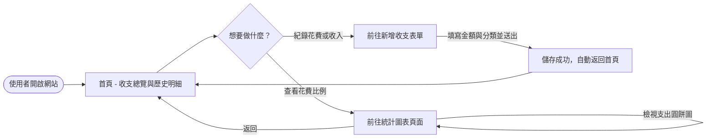
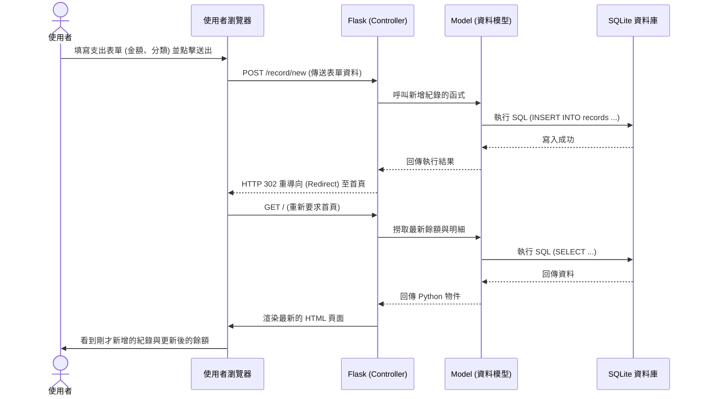

# 個人記帳簿系統 - 流程圖文件

## 1. 使用者流程圖 (User Flow)

這張圖展示了使用者進入網站後，可以進行的各項操作路徑：

---

## 2. 系統序列圖 (Sequence Diagram)

這張圖以「使用者新增一筆支出」為例，展示了系統內部前端（瀏覽器）與後端（Flask、SQLite）是如何溝通傳遞資料的：

---

## 3. 功能清單與路由對照表

根據上述流程，初步規劃出以下 URL 路徑與對應的操作：

| 功能名稱 | URL 路徑 | HTTP 方法 | 說明 |
| :--- | :--- | :---: | :--- |
| 首頁 (總覽與明細) | `/` | GET | 顯示目前總餘額以及歷史收支明細列表。 |
| 新增收支頁面 | `/record/new` | GET | 顯示用來填寫新增收入或支出的 HTML 表單。 |
| 處理新增收支 | `/record/new` | POST | 接收表單送出的資料，存入資料庫後重導向回首頁。 |
| 查看圓餅圖 | `/chart` | GET | 顯示支出分類比例的圓餅圖畫面。 |
